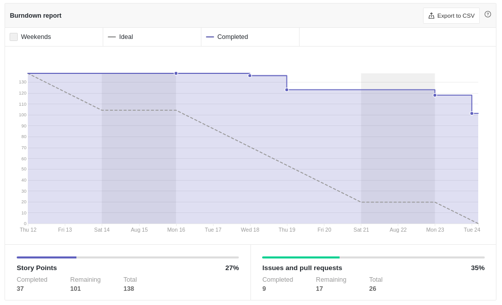
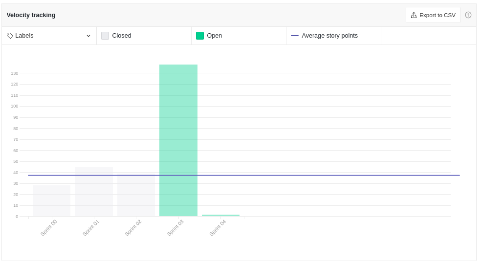
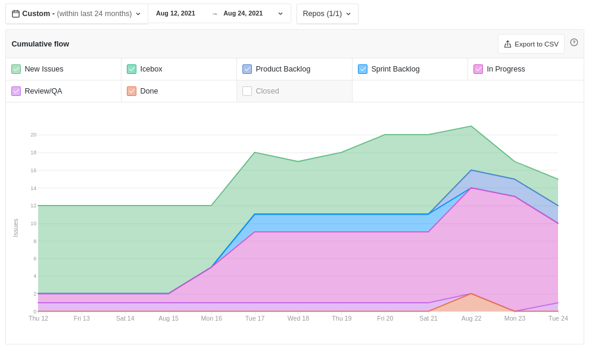

# Fechamento da Sprint 3

## Histórico de revisão

| **Data** |  **Versão** | **Modificação**  |  **Autor** |
|:-:|:-:|:-:|:-:|
|    24/08/2021   |  0.1 | Criação do documento  | Adrian Soares |

## Backlog da Sprint 

|ID|Descrição|Status|Pontos|
|:-|:-|:-|:-|
|#29|[Estudo do Relatório para prototipagem](https://github.com/fga-eps-mds/2021-1-hospitalar/issues/29)|Fechada|2|
|#16|[Criar Protótipo de Baixa Fidelidade](https://github.com/fga-eps-mds/2021-1-hospitalar/issues/16)|Fechada|8|
|#18|[Organizar treinamento de tecnologias](https://github.com/fga-eps-mds/2021-1-hospitalar/issues/18)|Fechada|13|
|#37|[Preparar e Fazer um Treinamento com o Grupo](https://github.com/fga-eps-mds/2021-1-hospitalar/issues/37)|Aberta|5|
|#24|[Abertura do Documento de Arquitetura](https://github.com/fga-eps-mds/2021-1-hospitalar/issues/24)|Fechada|13|
|#20|[Elaboração do RoadMap](https://github.com/fga-eps-mds/2021-1-hospitalar/issues/20)|Aberta|5|
|#22|[Elaboração do Documento de Visão](https://github.com/fga-eps-mds/2021-1-hospitalar/issues/22)|Fechada|8|
|#34|[Atualizar template e descrição de Issues passadas e presentes](https://github.com/fga-eps-mds/2021-1-hospitalar/issues/34)|Fechada|5|
|#33|[Políticas do Repositório](https://github.com/fga-eps-mds/2021-1-hospitalar/issues/33)|Fechada|2|
|#38|[Configuração do Docker File e Docker Compose](https://github.com/fga-eps-mds/2021-1-hospitalar/issues/38)|Fechada|8|
|#36|[Elaboração do Diagrama de Classes - Parte do Time B](https://github.com/fga-eps-mds/2021-1-hospitalar/issues/36)|Aberta|8|
|#46|[Elaboração do Diagrama de Classes](https://github.com/fga-eps-mds/2021-1-hospitalar/issues/46)|Aberta|8|
|#23|[Modelar Banco de Dados](https://github.com/fga-eps-mds/2021-1-hospitalar/issues/46)|Aberta|5|

## Pontuação Final

**Pontuação Total:** 90 Pontos Planejados  
**Débitos Técnicos Adicionados:** 31 Pontos  
**Pontos Concluídos:** 59 Pontos Concluídos  

## Débitos Técnicos de Sprints Anteriores

- Não houveram débitos técnicos para pagar nesta sprint

<!--OU

(#nº) nome da issue
  
(#nº) nome da issue-->

## Débitos Técnicos Gerados

<!--- Não foram gerados débitos nesta sprint

OU-->

(#37) Preparar e Fazer treinamento com o Grupo   
(#20) Elaboração do RoadMap  
(#46) Elaboração do Diagrama de Classes, Parte do Time B

## Retrospectiva

### Pontos Positivos

- Comunicação entre os Squads;

### Pontos Negativos

- Fechamento não contínuo de Issues
- Poucos Commits
- Utilização de arquivos sem adicionar no repositório

### Melhorias

- Utilizar, sempre, o ZenHub ao trabalhar;
- Utilizar, sempre, o repositórios ao trabalhar;
- Organizar o ZenHub
- Implementar Daylis

## Burndown

 Podemos observar a demora no fechamento das sprints, mesmo quando já estavam finalizadas, Kanban deve ser melhor utilizado e melhorado para melhor compreensão do time.
  
## Velocity

 

A média. Acredito que ainda não seja um valor confiável devido ao início da disciplina, com menos issues e menor entendimento das práticas.

## Cumulative Flow

Novamente, menor movimentação das issues no campos do Kanban

## Quadro de Conhecimentos

| Nome | Github | HTML | Javascript | Metodologia ágeis | Docker | Django | Mongodb |
| :-: | :-: | :-: | :-: | :-: | :-: | :-: | :-: |
| Adrian | &#129001; | &#129001; | &#129001; | &#129001; | &#128997; | &#128999; | &#128997; |
| Augusto | &#128997; | &#129000; | &#129001; | &#128999; | &#128998; | &#128997; | &#128997; |
| Daniel | &#128997; | &#129000; | &#129001; | &#128999; | &#128998; | &#128997; | &#128997; |
| Eduardo | &#128997; | &#129000; | &#129001; | &#128999; | &#128998; | &#128997; | &#128997; |
| Gustave | &#128997; | &#129000; | &#129001; | &#128999; | &#128998; | &#128997; | &#128997; |
| Magno | &#128997; | &#129000; | &#129001; | &#128999; | &#128998; | &#128997; | &#128997; |
| Ricardo | &#128997; | &#129000; | &#129001; | &#128999; | &#128998; | &#128997; | &#128997; |

| Cor | Legenda |
| :-: | :-: |
| &#128998; | Sou brabo |
| &#129001;| Consigo me virar |
| &#128999; | Sei mais ou menos|
| &#129000;  | Então... |
| &#128997; | Socorro!|
  
## Práticas ágeis
  
|ID    | Nome de prática ágil    | Sprint nº |
| :-: | :-: | :-: |
| 1    | Priorização do Backlog pelo PO | &#10004; |
| 2    | Desenvolvimento de processos e práticas facilitadas pelo SM | &#10060; |
| 3    | Reunião de planejamento de Sprint | &#10004; |
| 4    | Planning Poker | &#10060; |
| 5    | Comprometimento do time e do PO com o backlog do produto | &#10004; |
| 6    | Os membros da equipe são voluntários para tarefas | &#10004; |
| 7    | Restrospectiva da Sprint | &#10004; |
| 8    | Acompanhamento do Velocity | &#10004; |
| 9    | User Stories | &#10060; |
| 10 |    Refatorar quando e onde for possível | &#10060; |
| 11 | Todo código deve ter códigos unitários | &#10060; |
| 12 |    Todo código deve passar por testes unitários antes de ser liberado | &#10060; |
| 13 |     Acompanhamento do Squad Health Check | &#10060; |
| 14 |    Quadro de conhecimentos| &#10004; |

<!--
## Qualidade do Trabalho Entregue

Segundo a equipe a qualidade entregue foi de (nº). A escala dos valores é de 1 a 5.

| **Objetivo da Sprint** |  **Nota** |
|:-:|:-:|
|    Descrição do Objetivo   |  (nº) |
|    Descrição do Objetivo   |  (nº) |
|    ...   |  ... |
-->

## Riscos

|  **Risco**  | **Ação Preventiva** |**Ação Reativa** |
|:-:|:-:|:-:|
| Desmotivação para o trabalho | Comunicação constante e construção de confiança | Redistribuir tarefas |
| Não utilizar práticas ágeis | Reforço constante das Práticas | Modificar as práticas |
| Não entendimento dos problemas e requisitos | Reuniões de Sprint bem elaboradas, revisando o backlog | Marcar novas reuniões |
| Falta de conhecimento sobre as tecnologias | Pesquisas e Criação de Tutoriais | Ajuda dos monitores e da professora |
| Atrasos para a release | Reforçar trabalho contínuo e distribuído | Comunicação com a professora |
  
<!-- ## Burndown de Riscos (???) -->

## Análise pelo Scrum Master

A comunicação entre os squads de desenvolvimento está melhor.
Precisamos separar melhor as issues, definir melhor os responsáveis e distribuir melhor.
As pontuações das issues não refletem a complexidade, precisamos aplicar o planning poker mais vezes.
As tarefas nas issues precisam ser melhores definidas e as issues separadas em issues menores sempre que possível.
O repositório não estava sendo utilizado de maneira correta e estávamos com poucos commits e mau distribuídos. Focamos em definir as políticas de repositórios e fazer treinos para que não houvesse mais medo do uso do git. Agora todos já criam branches e abrem PR's.
O trabalho está sendo feito em cima da hora. Boa parte disso foi causado, além dos problemas citados anteriormente, pela reunião sendo feita segunda-feira, o que já nos deixava deslocados com os outros squads. Precisamos organizar melhor os horários e implementar dailys de acordo com os horários de trabalho definidos por todos.
